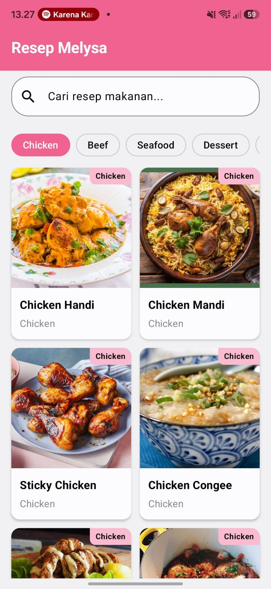
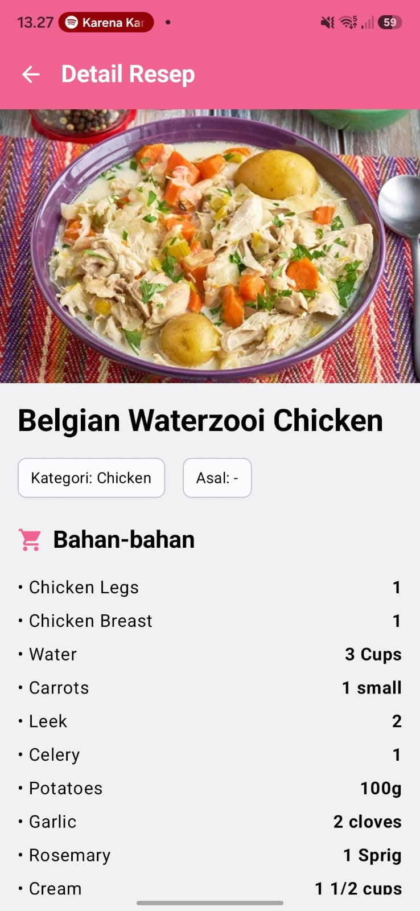

# Resep Melysa
> Aplikasi Katalog dan Eksplorasi Resep Makanan Berbasis TheMealDB API

---

## 👤 Identitas Praktikan
- **Nama Lengkap:** Melysa Ayu Wulan Sari
- **NIM:** [H1D024013]
- **Shift Awal:** [D]
- **Shift Akhir:** [E]
- **Link Video Penjelasan Kode:** [https://youtu.be/WPsvNSvGgME]

---

## 📱 Deskripsi Aplikasi

Resep Melysa merupakan aplikasi Android untuk mencari dan mengeksplorasi resep makanan menggunakan data dari **TheMealDB API**. Aplikasi ini memungkinkan pengguna mencari resep berdasarkan nama makanan, melihat daftar resep, serta membuka halaman detail resep yang berisi informasi seperti nama makanan, kategori, area asal, bahan dan takaran, serta instruksi memasak.

Aplikasi ditujukan untuk pengguna yang ingin mencari referensi resep makanan melalui perangkat Android dengan tampilan yang sederhana dan mudah digunakan.

---

## 🛠️ Penjelasan Teknis

### 1. Spesifikasi & Tech Stack
- **Bahasa:** Kotlin 2.2.10
- **UI Framework:** Jetpack Compose (Material 3)
- **Min SDK:** 24
- **Pola Arsitektur:** MVVM
- **API:** TheMealDB REST API

**Library Utama:**
- `Navigation Compose` — navigasi antara halaman Home dan Detail
- `ViewModel` & `StateFlow` — pengelolaan state UI
- `Retrofit` — komunikasi dengan REST API
- `Gson Converter` — proses parsing data JSON dari API
- `Coil Compose` — menampilkan gambar resep dari URL
- `Kotlin Coroutines` — menjalankan proses asynchronous
- `Material 3` — komponen dan desain antarmuka
- `LazyVerticalGrid` — menampilkan daftar resep dalam bentuk grid

### 2. Fitur Utama
- **Pencarian Resep:** pengguna dapat mencari resep berdasarkan nama makanan melalui search bar. Data pencarian diambil dari TheMealDB API.
- **Daftar Resep:** hasil pencarian ditampilkan menggunakan `LazyVerticalGrid` dalam bentuk kartu yang berisi gambar, nama resep, dan kategori.
- **Detail Resep:** pengguna dapat memilih salah satu resep untuk melihat informasi lengkap berupa gambar, nama, kategori, area, bahan dan takaran, serta instruksi memasak.
- **State UI:** aplikasi memiliki kondisi loading, data berhasil ditampilkan, data tidak ditemukan, dan error ketika terjadi masalah saat mengambil data.
- **Navigasi:** pengguna dapat berpindah dari halaman Home ke halaman Detail dan kembali menggunakan Navigation Compose.

### 3. Struktur Direktori Proyek
```text
app/src/main/java/com/pemmob/recipeexplorer/responsi/
├── data/
│   ├── model/
│   │   ├── Meal.kt
│   │   ├── MealResponse.kt
│   │   └── MealDetailResponse.kt
│   ├── remote/
│   │   ├── ApiService.kt
│   │   └── RetrofitClient.kt
│   └── repository/
│       ├── RecipeRepository.kt
│       └── RecipeRepositoryImpl.kt
│
├── ui/
│   ├── detail/
│   │   ├── DetailScreen.kt
│   │   └── DetailViewModel.kt
│   ├── home/
│   │   ├── HomeScreen.kt
│   │   └── HomeViewModel.kt
│   ├── navigation/
│   │   ├── AppNavigation.kt
│   │   └── Routes.kt
│   └── theme/
│       ├── Color.kt
│       ├── Theme.kt
│       └── Type.kt
│
└── MainActivity.kt
```

---

## 📸 Tangkapan Layar (Screenshots)

| Home | Detail |
|:---:|:---:|
|  |  |

---

## 🚀 Cara Menjalankan Proyek

1. **Prasyarat:**
   - Android Studio versi terbaru yang mendukung project Android
   - JDK 17 atau lebih baru
   - Perangkat Android dengan USB Debugging aktif atau Emulator
   - Koneksi internet untuk mengambil data dari TheMealDB API

2. **Clone repository:**
   ```bash
   git clone (https://github.com/MelysaAyu/RESPONSI-PRAKTIKUM-PEMMOB)
   ```

3. Buka folder proyek di **Android Studio**.

4. Tunggu proses **Gradle Sync** selesai.

5. Pilih target perangkat atau emulator.

6. Jalankan aplikasi dengan menekan tombol **Run (`Shift + F10`)**.

---

## 🔗 API yang Digunakan

Aplikasi menggunakan **TheMealDB API** untuk mengambil data resep.

**Search Recipe:**
```text
https://www.themealdb.com/api/json/v1/1/search.php?s={nama_makanan}
```

**Recipe Detail:**
```text
https://www.themealdb.com/api/json/v1/1/lookup.php?i={id_recipe}
```

---

## 🏗️ Implementasi Arsitektur

Aplikasi menggunakan pola arsitektur **MVVM (Model-View-ViewModel)**.

- **Model:** menyimpan struktur data resep dari API.
- **Repository:** menjadi perantara antara ViewModel dan sumber data dari API.
- **ViewModel:** mengelola state seperti data resep, loading, error, dan pencarian.
- **View:** menggunakan Jetpack Compose untuk menampilkan UI berdasarkan state yang diberikan ViewModel.

Alur pengambilan data:

```text
Composable
    ↓
ViewModel
    ↓
Repository
    ↓
Retrofit / ApiService
    ↓
TheMealDB API
    ↓
Repository
    ↓
ViewModel
    ↓
StateFlow
    ↓
Composable
```

---

## 🎯 Implementasi Kotlin

Beberapa fitur Kotlin yang digunakan dalam aplikasi:

- **Data class** untuk merepresentasikan data resep.
- **Null safety** pada data yang diterima dari API.
- **Lambda** pada callback navigasi dan interaksi UI.
- **Extension function** untuk mengolah daftar bahan dan takaran resep.
- **Coroutines** untuk proses pengambilan data secara asynchronous.
- **StateFlow** untuk mengelola perubahan state pada UI.

---
